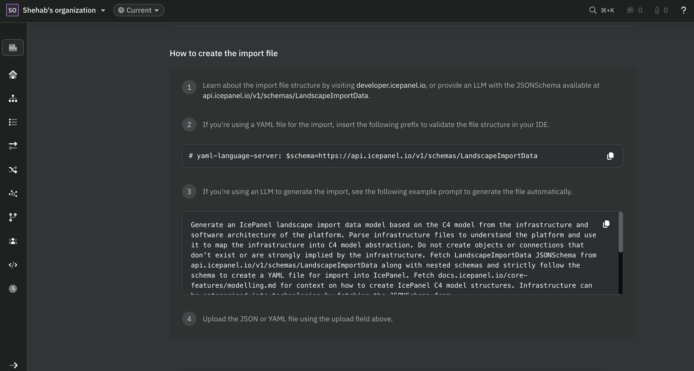

This guide shows how to import and maintain landscapes as code using the [LandscapeImportData](https://api.icepanel.io/v1/schemas/LandscapeImportData) <Tooltip tip="A declarative language that provides a standardized way to describe and validate JSON data">JSON schema</Tooltip>.

This is useful for:
- Generating diagrams with LLMs
- Syncing landscapes via CI/CD pipelines
- Maintaining diagrams in a git repository

<Note>
Prerequisites:
- IcePanel account
- API key (created from `https://app.icepanel.io/organizations/:organizationId/manage/api-keys`)
</Note>

## Steps

<Steps>
  <Step title="Select a landscape">
    To import diagrams into a landscape, you will need the landscape ID, which can be found in the URL:

    ```text
    https://app.icepanel.io/landscapes/:landscapeId/versions/latest/overview
    ```

    Or, you can get the landscape ID with a `GET` request to the `/landscapes` endpoint.

    <EndpointRequestSnippet endpoint="GET /organizations/{organizationId}/landscapes" />

    This returns a list of all landscapes in your organization. Note the `id` of the landscape you want to import into.

  </Step>

  <Step title="Create your import file">

    Your landscape can be modelled in a JSON or YAML file by using the [LandscapeImportData](https://api.icepanel.io/v1/schemas/LandscapeImportData) JSON schema. Each data model has a persistent `id` field, which is useful for upserting existing models.

    <Accordion title="Example JSON">
    ```json
    {
  "modelObjects": [
    {
      "id": "domain-ecommerce",
      "name": "E-Commerce Platform",
      "parentId": null,
      "type": "domain"
    },

    {
      "id": "person-customer",
      "name": "Customer",
      "parentId": "domain-ecommerce",
      "type": "actor",
      "tagIds": ["tag-external"]
    },
    {
      "id": "person-admin",
      "name": "Admin User",
      "parentId": "domain-ecommerce",
      "type": "actor",
      "tagIds": ["tag-internal"]
    },

    {
      "id": "system-storefront",
      "name": "Storefront",
      "parentId": "domain-ecommerce",
      "type": "system",
      "tagIds": ["tag-internal"]
    },
    {
      "id": "system-payment",
      "name": "Payment Gateway",
      "parentId": "domain-ecommerce",
      "type": "system",
      "tagIds": ["tag-external"]
    },
    {
      "id": "system-email",
      "name": "Email Service",
      "parentId": "domain-ecommerce",
      "type": "system",
      "tagIds": ["tag-external"]
    },

    {
      "id": "container-web",
      "name": "Web App",
      "parentId": "system-storefront",
      "type": "app",
      "tagIds": ["tag-internal"]
    },
    {
      "id": "container-api",
      "name": "API Server",
      "parentId": "system-storefront",
      "type": "app",
      "tagIds": ["tag-internal"]
    },
    {
      "id": "container-db",
      "name": "Product Database",
      "parentId": "system-storefront",
      "type": "database",
      "tagIds": ["tag-internal"]
    },
    {
      "id": "container-cache",
      "name": "Cache",
      "parentId": "system-storefront",
      "type": "database",
      "tagIds": ["tag-internal"]
    },

    {
      "id": "component-product-service",
      "name": "Product Service",
      "parentId": "container-api",
      "type": "component",
      "tagIds": ["tag-internal"]
    },
    {
      "id": "component-order-service",
      "name": "Order Service",
      "parentId": "container-api",
      "type": "component",
      "tagIds": ["tag-internal"]
    },
    {
      "id": "component-auth-service",
      "name": "Auth Service",
      "parentId": "container-api",
      "type": "component",
      "tagIds": ["tag-internal"]
    },
    {
      "id": "component-notification-service",
      "name": "Notification Service",
      "parentId": "container-api",
      "type": "component",
      "tagIds": ["tag-internal"]
    }
  ],

  "modelConnections": [
    {
      "id": "conn-customer-web",
      "name": "Browses store via HTTPS",
      "direction": "outgoing",
      "originId": "person-customer",
      "targetId": "container-web"
    },
    {
      "id": "conn-admin-web",
      "name": "Manages catalog via HTTPS",
      "direction": "outgoing",
      "originId": "person-admin",
      "targetId": "container-web"
    },
    {
      "id": "conn-web-api",
      "name": "REST API calls",
      "direction": "outgoing",
      "originId": "container-web",
      "targetId": "container-api"
    },
    {
      "id": "conn-api-db",
      "name": "Reads/writes",
      "direction": "outgoing",
      "originId": "container-api",
      "targetId": "container-db"
    },
    {
      "id": "conn-api-cache",
      "name": "Caches product data",
      "direction": "outgoing",
      "originId": "container-api",
      "targetId": "container-cache"
    },
    {
      "id": "conn-order-payment",
      "name": "Processes payment",
      "direction": "outgoing",
      "originId": "component-order-service",
      "targetId": "system-payment"
    },
    {
      "id": "conn-notification-email",
      "name": "Sends order confirmations",
      "direction": "outgoing",
      "originId": "component-notification-service",
      "targetId": "system-email"
    },
    {
      "id": "conn-product-db",
      "name": "Queries product catalog",
      "direction": "outgoing",
      "originId": "component-product-service",
      "targetId": "container-db"
    },
    {
      "id": "conn-auth-db",
      "name": "Reads user records",
      "direction": "outgoing",
      "originId": "component-auth-service",
      "targetId": "container-db"
    },
    {
      "id": "conn-order-notification",
      "name": "Triggers notifications",
      "direction": "outgoing",
      "originId": "component-order-service",
      "targetId": "component-notification-service"
    }
  ],

  "tagGroups": [
    {
      "id": "tag-group-ownership",
      "name": "Ownership",
      "icon": "tag"
    }
  ],

  "tags": [
    {
      "id": "tag-internal",
      "name": "Internal",
      "color": "blue",
      "groupId": "tag-group-ownership"
    },
    {
      "id": "tag-external",
      "name": "External",
      "color": "orange",
      "groupId": "tag-group-ownership"
    }
  ]
}
```
    </Accordion>

    <Accordion title="Example YAML">
    ```yaml
    # yaml-language-server: $schema=https://api.icepanel.io/v1/schemas/LandscapeImportData

tagGroups:
  - id: tag-group-ownership
    name: Ownership
    icon: tag

tags:
  - id: tag-internal
    name: Internal
    color: blue
    groupId: tag-group-ownership
  - id: tag-external
    name: External
    color: orange
    groupId: tag-group-ownership

modelObjects:
  - id: domain-ecommerce
    name: E-Commerce Platform
    type: domain

  - id: person-customer
    name: Customer
    type: actor
    parentId: domain-ecommerce
    tagIds:
      - tag-external

  - id: person-admin
    name: Admin User
    type: actor
    parentId: domain-ecommerce
    tagIds:
      - tag-internal

  - id: system-storefront
    name: Storefront
    type: system
    parentId: domain-ecommerce
    tagIds:
      - tag-internal

  - id: system-payment
    name: Payment Gateway
    type: system
    parentId: domain-ecommerce
    tagIds:
      - tag-external

  - id: system-email
    name: Email Service
    type: system
    parentId: domain-ecommerce
    tagIds:
      - tag-external

  - id: container-web
    name: Web App
    type: app
    parentId: system-storefront
    tagIds:
      - tag-internal

  - id: container-api
    name: API Server
    type: app
    parentId: system-storefront
    tagIds:
      - tag-internal

  - id: container-db
    name: Product Database
    type: database
    parentId: system-storefront
    tagIds:
      - tag-internal

  - id: container-cache
    name: Cache
    type: database
    parentId: system-storefront
    tagIds:
      - tag-internal

  - id: component-product-service
    name: Product Service
    type: component
    parentId: container-api
    tagIds:
      - tag-internal

  - id: component-order-service
    name: Order Service
    type: component
    parentId: container-api
    tagIds:
      - tag-internal

  - id: component-auth-service
    name: Auth Service
    type: component
    parentId: container-api
    tagIds:
      - tag-internal

  - id: component-notification-service
    name: Notification Service
    type: component
    parentId: container-api
    tagIds:
      - tag-internal

modelConnections:
  - id: conn-customer-web
    name: Browses store via HTTPS
    direction: outgoing
    originId: person-customer
    targetId: container-web

  - id: conn-admin-web
    name: Manages catalog via HTTPS
    direction: outgoing
    originId: person-admin
    targetId: container-web

  - id: conn-web-api
    name: REST API calls
    direction: outgoing
    originId: container-web
    targetId: container-api

  - id: conn-api-db
    name: Reads/writes
    direction: outgoing
    originId: container-api
    targetId: container-db

  - id: conn-api-cache
    name: Caches product data
    direction: outgoing
    originId: container-api
    targetId: container-cache

  - id: conn-order-payment
    name: Processes payment
    direction: outgoing
    originId: component-order-service
    targetId: system-payment

  - id: conn-notification-email
    name: Sends order confirmations
    direction: outgoing
    originId: component-notification-service
    targetId: system-email

  - id: conn-product-db
    name: Queries product catalog
    direction: outgoing
    originId: component-product-service
    targetId: container-db

  - id: conn-auth-db
    name: Reads user records
    direction: outgoing
    originId: component-auth-service
    targetId: container-db

  - id: conn-order-notification
    name: Triggers notifications
    direction: outgoing
    originId: component-order-service
    targetId: component-notification-service
```
    </Accordion>

  </Step>

  <Step title="Import your landscape">
    You can import the file through the UI or the API.

    Each `id` in your import file maps to a resource in IcePanel. It's either created if the resource does not exist or updated otherwise.

    <Tabs>
      <Tab title="UI">
        From the landscape page, click **Import model > File Upload** and upload your file.

        
      </Tab>
      <Tab title="API">
        Use the import endpoint and pass your file in the request body.

        <EndpointRequestSnippet endpoint="POST /landscapes/{landscapeId}/versions/{versionId}/import" />
      </Tab>
    </Tabs>

  </Step>

  <Step title="Set up CI/CD">
    To keep your landscape in sync automatically, call the import endpoint in a CI/CD job on every push to your main branch.

    <Tabs>
      <Tab title="GitHub Actions">
        Add two repository secrets in GitHub (**Settings > Secrets and variables > Actions**):
        - `ICEPANEL_LANDSCAPE_ID`
        - `ICEPANEL_API_KEY`

        Create a workflow file at `.github/workflows/icepanel-sync.yml`:

        <Files>
          <Folder name="your-project" defaultOpen>
            <Folder name=".github" defaultOpen>
              <Folder name="workflows" defaultOpen>
                <File name="icepanel-sync.yml" />
              </Folder>
            </Folder>
            <File name="icepanel-landscape-import.yaml" />
            <File name="README.md" />
          </Folder>
        </Files>

        ```yaml title=".github/workflows/icepanel-sync.yml"
        name: Synchronise IcePanel landscape

        on:
          push:
            branches:
              - main
              - master

        jobs:
          synchronise-landscape:
            runs-on: ubuntu-latest
            steps:
              - uses: actions/checkout@v4

              - name: Import landscape
                run: |
                  curl -sf -X POST "https://api.icepanel.io/v1/landscapes/${{ vars.ICEPANEL_LANDSCAPE_ID }}/versions/latest/import" \
                    -H "X-API-Key: ${{ secrets.ICEPANEL_API_KEY }}" \
                    -H "Content-Type: application/yaml" \
                    --data-binary @icepanel-landscape-import.yaml
        ```
        This triggers the `synchronise-landscape` job on every push to `main`/`master`.

      </Tab>
      <Tab title="GitLab CI/CD">
        Add two CI/CD variables in GitLab (**Settings > CI/CD > Variables**):
        - `ICEPANEL_LANDSCAPE_ID`
        - `ICEPANEL_API_KEY`

        Create a `.gitlab-ci.yml` file in your repository root:

        <Files>
          <Folder name="your-project" defaultOpen>
            <File name=".gitlab-ci.yml" />
            <File name="icepanel-landscape-import.yaml" />
            <File name="README.md" />
          </Folder>
        </Files>

        ```yaml title=".gitlab-ci.yml"
        stages:
          - deploy

        synchronise-landscape:
          stage: deploy
          image: alpine:latest
          before_script:
            - apk add --no-cache curl
          script:
            - |
              curl -sf -X POST "https://api.icepanel.io/v1/landscapes/${ICEPANEL_LANDSCAPE_ID}/versions/latest/import" \
                -H "X-API-Key: ${ICEPANEL_API_KEY}" \
                -H "Content-Type: application/yaml" \
                --data-binary @icepanel-landscape-import.yaml
          rules:
            - if: $CI_COMMIT_BRANCH == "main" || $CI_COMMIT_BRANCH == "master"
        ```
        This triggers the `synchronise-landscape` job in the `deploy` stage on every push to `main`/`master`.
      </Tab>
    </Tabs>
  </Step>
</Steps>

## Generating diagrams with LLMs

LLMs can generate a valid import file from a description of your architecture. The [LandscapeImportData](https://api.icepanel.io/v1/schemas/LandscapeImportData) schema is publicly accessible, so you can point the LLM directly at it to validate the output.

See an example prompt that generates an import file for IcePanel.

```text title="Prompt"
Generate an IcePanel landscape import data model based on the C4 model from the infrastructure and software architecture of the platform.

Parse infrastructure files to understand the platform and use it to map the infrastructure into C4 model abstraction.

Do not create objects or connections that don't exist or are strongly implied by the infrastructure.
Fetch LandscapeImportData JSONSchema from api.icepanel.io/v1/schemas/LandscapeImportData along with nested schemas and strictly follow the schema to create a YAML file for import into IcePanel.

Fetch docs.icepanel.io/core-features/modelling.md for context on how to create IcePanel C4 model structures.
Infrastructure can be categorized into technologies by fetching the JSONSchema from api.icepanel.io/v1/schemas/CatalogTechnologyType.

Perform an exhaustive search for technologies using http requests to api.icepanel.io/v1/catalog/technologies?filter[name]=NodeJS and add the id to the technologyIds array.
If a technology cannot be found try reducing the search term to be more specific to find a match.

If a primary technology exists then assign the visual icon to icon.technologyId.

Write the resulting import data to a YAML file to the file named icepanel-landscape-import.yaml in the current directory.

Prefix the YAML file with # yaml-language-server: $schema=https://api.icepanel.io/v1/schemas/LandscapeImportData.
```

Example output:

<Accordion title="icepanel-landscape-import.yaml">
```yaml
# yaml-language-server: $schema=https://api.icepanel.dev/v1/schemas/LandscapeImportData

modelObjects:

  # ── Domain ────────────────────────────────────────────────────────────────

  - id: domain-icepanel
    name: IcePanel Platform
    type: domain
    description: >-
      IcePanel is a multi-tenant SaaS platform for collaborative software
      architecture documentation and diagramming using C4 model notation.
      Deployed on Google Cloud Platform.

  # ── Actors ────────────────────────────────────────────────────────────────

  - id: actor-user
    name: Software Architect / Developer
    parentId: domain-icepanel
    type: actor
    description: >-
      Software engineers and architects who use IcePanel to create, maintain,
      and share C4 architecture diagrams collaboratively with their teams.

  # ── Visual Groups ─────────────────────────────────────────────────────────

  - id: group-external-services
    name: External Services
    parentId: domain-icepanel
    type: group
    description: Third-party SaaS services that IcePanel integrates with.

  - id: group-source-integrations
    name: Source Code Platforms
    parentId: domain-icepanel
    type: group
    description: Source code hosting and DevOps platforms that users can link to architecture objects.

  # ── Systems ───────────────────────────────────────────────────────────────

  - id: system-icepanel
    name: IcePanel
    parentId: domain-icepanel
    type: system
    external: false
    description: >-
      Multi-tenant SaaS platform for creating and maintaining collaborative C4
      architecture diagrams. Runs as a collection of microservices on Google
      Cloud Platform using Cloud Run, backed by Firestore, Redis, and Cloud
      Storage.

  - id: system-stripe
    name: Stripe
    parentId: domain-icepanel
    type: system
    external: true
    groupIds:
      - group-external-services
    description: >-
      Payment processing platform used for subscription billing, plan management,
      and payment collection across multiple currencies (CAD, EUR, GBP, USD).

  - id: system-openai
    name: OpenAI
    parentId: domain-icepanel
    type: system
    external: true
    groupIds:
      - group-external-services
    description: >-
      AI platform providing large language models used to power AI-assisted
      architecture modelling and description generation features.

  - id: system-mixpanel
    name: Mixpanel
    parentId: domain-icepanel
    type: system
    external: true
    groupIds:
      - group-external-services
    description: >-
      Product analytics platform for tracking user behaviour, feature adoption,
      and engagement metrics to guide product decisions.

  - id: system-sentry
    name: Sentry2
    parentId: domain-icepanel
    type: system
    external: true
    groupIds:
      - group-external-services
    description: >-
      Application error monitoring and performance tracking service that captures
      runtime exceptions and alerts the engineering team.

  - id: system-resend
    name: Resend
    parentId: domain-icepanel
    type: system
    external: true
    groupIds:
      - group-external-services
    description: >-
      Transactional email delivery service used to send user invitations,
      onboarding sequences, and notification emails.

  - id: system-slack
    name: Slack
    parentId: domain-icepanel
    type: system
    external: true
    groupIds:
      - group-external-services
    description: >-
      Team messaging platform that receives automated architecture change
      notifications triggered by IcePanel automation rules configured by users.

  - id: system-linear
    name: Linear
    parentId: domain-icepanel
    type: system
    external: true
    groupIds:
      - group-external-services
    description: >-
      Issue tracking platform used internally for bug tracking and for surfacing
      customer-reported issues to the engineering team.

  - id: system-datadog
    name: Datadog
    parentId: domain-icepanel
    type: system
    external: true
    groupIds:
      - group-external-services
    description: >-
      Infrastructure monitoring, APM, and log management platform used to
      observe service health, performance, and operational metrics.

  - id: system-github
    name: GitHub
    parentId: domain-icepanel
    type: system
    external: true
    groupIds:
      - group-source-integrations
    description: >-
      Source code hosting platform that users can link to architecture objects
      and that powers the CI/CD pipeline for IcePanel deployments.

  - id: system-gitlab
    name: GitLab
    parentId: domain-icepanel
    type: system
    external: true
    groupIds:
      - group-source-integrations
    description: >-
      Source code and DevOps platform that IcePanel integrates with for
      repository and pipeline linking within architecture diagrams.

  - id: system-azure-devops
    name: Azure DevOps
    parentId: domain-icepanel
    type: system
    external: true
    groupIds:
      - group-source-integrations
    description: >-
      Microsoft Azure DevOps platform that IcePanel integrates with for source
      repository linking and pipeline integrations.

  - id: system-bitbucket
    name: Bitbucket
    parentId: domain-icepanel
    type: system
    external: true
    groupIds:
      - group-source-integrations
    description: >-
      Atlassian source code hosting platform that IcePanel integrates with for
      repository linking within architecture objects.

  # ── IcePanel Containers ───────────────────────────────────────────────────

  - id: app-web
    name: Web Application
    parentId: system-icepanel
    type: app
    caption: Vue.js SPA
    description: >-
      Single-page application built with Vue.js 3, TypeScript, Pinia, Vuetify,
      Pixi.js, and TipTap that provides the main user interface for collaborative
      C4 architecture modelling and diagram editing. Built with Vite and served
      via Google Cloud CDN.

  - id: app-api
    name: API Service
    parentId: system-icepanel
    type: app
    caption: Node.js REST API
    description: >-
      Core REST API service built with Node.js, TypeScript, and Express that
      handles all business logic including authentication, landscape management,
      model CRUD operations, billing, and external service integrations.
      Deployed on Cloud Run. API contract defined with an OpenAPI specification
      and TypeScript client auto-generated via SDK generation.

  - id: app-realtime
    name: Real-time Service
    parentId: system-icepanel
    type: app
    caption: Node.js / Socket.IO
    description: >-
      WebSocket service built with Node.js and Socket.IO that broadcasts
      real-time model change events to connected clients, enabling live
      multi-user collaboration on shared architecture diagrams. Deployed on
      Cloud Run and scaled horizontally with Redis pub/sub coordination.

  - id: app-action-log
    name: Action Log Service 2
    parentId: system-icepanel
    type: app
    caption: Node.js Worker
    description: >-
      Background service that subscribes to Firestore change events via Cloud
      Pub/Sub, records a full audit trail of architecture changes, updates
      contributor statistics, and exports analytics data to BigQuery.
      Deployed on Cloud Run and triggered via Eventarc.

  - id: app-automation
    name: Automation Service
    parentId: system-icepanel
    type: app
    caption: Node.js Event Processor
    description: >-
      Event-driven service that evaluates user-configured automation rules when
      architecture changes occur and triggers configured actions such as Slack
      notifications or synchronising external tool integrations. Deployed on
      Cloud Run and triggered via Eventarc.

  - id: app-render
    name: Render Service
    parentId: system-icepanel
    type: app
    caption: Node.js / Puppeteer
    description: >-
      Headless browser service built with Puppeteer that renders C4 architecture
      diagrams to high-quality PDF and PNG files for export. Deployed on Cloud
      Run and triggered asynchronously via Cloud Pub/Sub.

  - id: app-pubsub
    name: Cloud Pub/Sub
    parentId: system-icepanel
    type: app
    caption: Message Broker
    description: >-
      Google Cloud Pub/Sub message broker with Eventarc triggers that route
      Firestore document change events to background processing services,
      decoupling the API service from asynchronous processing workflows.

  - id: store-firestore
    name: Cloud Firestore
    parentId: system-icepanel
    type: store
    caption: Primary Database
    description: >-
      Google Cloud Firestore NoSQL document database serving as the primary data
      store for all landscape data including model objects, connections, diagrams,
      flows, comments, tags, and user data. Supports real-time listeners used by
      the real-time service for live collaboration.

  - id: store-redis
    name: Cloud Memorystore (Redis)
    parentId: system-icepanel
    type: store
    caption: Cache & Pub/Sub
    description: >-
      Managed Redis instance used for API response caching to reduce Firestore
      read latency, and for pub/sub coordination across multiple Cloud Run
      instances of the real-time service to ensure all clients receive updates.
    technologyIds:
      - 4IpQAof5QthfBnNHOq6H
    icon:
      technologyId: 4IpQAof5QthfBnNHOq6H

  - id: store-gcs
    name: Cloud Storage
    parentId: system-icepanel
    type: store
    caption: File Storage
    description: >-
      Google Cloud Storage buckets used for storing user-uploaded assets,
      technology catalog icons, exported diagram files (PDF/PNG), and
      application data backups.
    technologyIds:
      - 3cc0cIZIk4Mos3HufC7q
    icon:
      technologyId: 3cc0cIZIk4Mos3HufC7q

  - id: store-bigquery
    name: BigQuery
    parentId: system-icepanel
    type: store
    caption: Analytics Warehouse
    description: >-
      Google Cloud BigQuery serverless data warehouse used to store and query
      platform-level analytics including user activity, feature usage, and
      business metrics exported by the Action Log service.
    technologyIds:
      - 1LjoEJGZgj1Ec7nCVgvB
    icon:
      technologyId: 1LjoEJGZgj1Ec7nCVgvB

modelConnections:

  # ── User ──────────────────────────────────────────────────────────────────

  - id: conn-user-web
    name: Models architecture
    originId: actor-user
    targetId: app-web
    direction: outgoing
    description: >-
      Architects and developers access IcePanel through a web browser to create,
      edit, and collaborate on C4 architecture diagrams.

  # ── Web Application ───────────────────────────────────────────────────────

  - id: conn-web-api
    name: API calls
    originId: app-web
    targetId: app-api
    direction: outgoing
    description: >-
      The SPA communicates with the API service over HTTPS using a generated
      TypeScript client (from the OpenAPI spec) to perform all CRUD operations
      on landscapes, model objects, connections, and diagrams.

  - id: conn-web-realtime
    name: Live collaboration
    originId: app-web
    targetId: app-realtime
    direction: outgoing
    description: >-
      The web application maintains a persistent WebSocket (Socket.IO) connection
      to receive real-time model change events pushed by other collaborators
      editing the same landscape.

  # ── API Service ───────────────────────────────────────────────────────────

  - id: conn-api-firestore
    name: Reads and writes data
    originId: app-api
    targetId: store-firestore
    direction: outgoing
    description: >-
      The API service uses Firestore as its primary data store, performing reads
      and writes on all model data using transactions and optimistic concurrency
      control via commit counters.

  - id: conn-api-redis
    name: Caches responses
    originId: app-api
    targetId: store-redis
    direction: outgoing
    description: >-
      The API service caches frequently accessed Firestore data in Redis to
      reduce read latency and Firestore costs.

  - id: conn-api-gcs
    name: Stores files
    originId: app-api
    targetId: store-gcs
    direction: outgoing
    description: >-
      The API service stores user-uploaded files and technology catalog icons
      in Cloud Storage buckets.

  - id: conn-api-pubsub
    name: Publishes events
    originId: app-api
    targetId: app-pubsub
    direction: outgoing
    description: >-
      Firestore document change events are routed via Eventarc triggers to Cloud
      Pub/Sub topics, which fan out to downstream background processing services.

  - id: conn-api-stripe
    name: Manages subscriptions
    originId: app-api
    targetId: system-stripe
    direction: outgoing
    description: >-
      The API service integrates with Stripe to manage customer subscriptions,
      process payments, handle plan upgrades and downgrades, and respond to
      billing webhook events across multiple currencies.

  - id: conn-api-openai
    name: AI-powered features
    originId: app-api
    targetId: system-openai
    direction: outgoing
    description: >-
      The API service calls OpenAI language models to power AI-assisted
      architecture modelling features such as generating diagram content
      from natural language descriptions.

  - id: conn-api-resend
    name: Sends emails
    originId: app-api
    targetId: system-resend
    direction: outgoing
    description: >-
      The API service sends transactional emails via Resend for user invitations,
      team notifications, and onboarding email sequences.

  - id: conn-api-mixpanel
    name: Tracks product usage
    originId: app-api
    targetId: system-mixpanel
    direction: outgoing
    description: >-
      The API service sends product usage and feature adoption events to Mixpanel
      to power analytics dashboards and guide product decisions.

  - id: conn-api-sentry
    name: Reports errors
    originId: app-api
    targetId: system-sentry
    direction: outgoing
    description: >-
      The API service uses the Sentry SDK to capture and report runtime
      exceptions and performance issues for monitoring and debugging.

  - id: conn-api-linear
    name: Creates issues
    originId: app-api
    targetId: system-linear
    direction: outgoing
    description: >-
      The API service creates Linear issues for internal tracking of bugs and
      customer-reported problems escalated through the support workflow.

  - id: conn-api-datadog
    name: Sends metrics and logs
    originId: app-api
    targetId: system-datadog
    direction: outgoing
    description: >-
      The API service emits operational metrics, traces, and structured logs to
      Datadog for infrastructure monitoring and performance observability.

  # ── Real-time Service ─────────────────────────────────────────────────────

  - id: conn-realtime-firestore
    name: Listens for changes
    originId: app-realtime
    targetId: store-firestore
    direction: outgoing
    description: >-
      The real-time service subscribes to Firestore real-time listeners on
      landscape collections and forwards change events to all connected
      WebSocket clients for live diagram updates.

  - id: conn-realtime-redis
    name: Coordinates instances
    originId: app-realtime
    targetId: store-redis
    direction: outgoing
    description: >-
      The real-time service uses Redis pub/sub to propagate change events across
      multiple stateless Cloud Run instances, ensuring every connected client
      receives updates regardless of which instance they are connected to.

  # ── Cloud Pub/Sub ─────────────────────────────────────────────────────────

  - id: conn-pubsub-actionlog
    name: Action events
    originId: app-pubsub
    targetId: app-action-log
    direction: outgoing
    description: >-
      Cloud Pub/Sub delivers Firestore document change events to the Action Log
      service for recording change history and updating contributor statistics.

  - id: conn-pubsub-automation
    name: Architecture events
    originId: app-pubsub
    targetId: app-automation
    direction: outgoing
    description: >-
      Cloud Pub/Sub delivers architecture change events to the Automation service
      to evaluate and trigger configured automation rules.

  - id: conn-pubsub-render
    name: Export requests
    originId: app-pubsub
    targetId: app-render
    direction: outgoing
    description: >-
      Cloud Pub/Sub delivers diagram export requests to the Render service for
      asynchronous PDF and PNG generation.

  # ── Action Log Service ────────────────────────────────────────────────────

  - id: conn-actionlog-firestore
    name: Records history
    originId: app-action-log
    targetId: store-firestore
    direction: outgoing
    description: >-
      The Action Log service writes processed action events, contributor
      statistics, and versioned change history back to Cloud Firestore.

  - id: conn-actionlog-bigquery
    name: Exports analytics
    originId: app-action-log
    targetId: store-bigquery
    direction: outgoing
    description: >-
      The Action Log service exports aggregated usage and analytics data to
      BigQuery for platform-level reporting and business intelligence queries.

  # ── Automation Service ────────────────────────────────────────────────────

  - id: conn-automation-firestore
    name: Reads automation rules
    originId: app-automation
    targetId: store-firestore
    direction: outgoing
    description: >-
      The Automation service reads user-configured automation rules and landscape
      data from Firestore and writes automation execution results back.

  - id: conn-automation-slack
    name: Sends notifications
    originId: app-automation
    targetId: system-slack
    direction: outgoing
    description: >-
      The Automation service sends architecture change notifications to
      user-configured Slack channels via the Slack Web API.

  - id: conn-automation-github
    name: Syncs with repositories
    originId: app-automation
    targetId: system-github
    direction: outgoing
    description: >-
      The Automation service integrates with GitHub to link architecture objects
      to source code repositories and respond to repository events.

  - id: conn-automation-gitlab
    name: Syncs with repositories
    originId: app-automation
    targetId: system-gitlab
    direction: outgoing
    description: >-
      The Automation service integrates with GitLab for source code repository
      linking and event-driven architecture updates.

  - id: conn-automation-azuredevops
    name: Syncs with repositories
    originId: app-automation
    targetId: system-azure-devops
    direction: outgoing
    description: >-
      The Automation service integrates with Azure DevOps for source code
      repository and pipeline linking within architecture diagrams.

  - id: conn-automation-bitbucket
    name: Syncs with repositories
    originId: app-automation
    targetId: system-bitbucket
    direction: outgoing
    description: >-
      The Automation service integrates with Bitbucket for source code repository
      linking and event-driven integrations.

  # ── Render Service ────────────────────────────────────────────────────────

  - id: conn-render-gcs
    name: Saves exports
    originId: app-render
    targetId: store-gcs
    direction: outgoing
    description: >-
      The Render service saves generated PDF and PNG diagram exports to Cloud
      Storage, from where users can download them via the API.

tagGroups:
  - id: tg-deployment
    name: Deployment
    icon: cloud

tags:
  - id: tag-cloud-run
    name: Cloud Run
    groupId: tg-deployment
    color: blue

  - id: tag-gcp
    name: Google Cloud Platform
    groupId: tg-deployment
    color: dark-blue
```
</Accordion>

## Prune option

By default, data models that exist in IcePanel but are missing from your import file are left untouched. To have IcePanel **delete** models not present in the import file, add the `prune=true` query parameter.

<Warning>
  Note that `prune=true` is a destructive operation. Any model objects, connections, tags, or tag groups in IcePanel that are **not** in your import file will be **permanently** deleted. Make sure your import file is the complete source of truth before using this option.
</Warning>

```bash
curl -sf -X POST "https://api.icepanel.io/v1/landscapes/$ICEPANEL_LANDSCAPE_ID/versions/latest/import?prune=true" \
  -H "X-API-Key: $ICEPANEL_API_KEY" \
  -H "Content-Type: application/yaml" \
  --data-binary @icepanel-landscape-import.yaml
```

## Namespace option

A namespace is a label that groups models by their import source. You can add a `namespace` to your import file to separate models by import source. When used with `prune=true`, only models in the same namespace are deleted. Models from other namespaces are left untouched.

This is useful for large organizations running multiple CI/CD pipelines from different repositories against the same landscape, with each pipeline managing its own models independently.

You can set the namespace in your YAML file:

```yaml
# yaml-language-server: $schema=https://api.icepanel.io/v1/schemas/LandscapeImportData

namespace: my-repo

modelObjects:
  - id: system-storefront
    name: Storefront
    type: system
```

Or pass it directly in the request body when using JSON:

```bash
curl -sf -X POST "https://api.icepanel.io/v1/landscapes/$ICEPANEL_LANDSCAPE_ID/versions/latest/import" \
  -H "X-API-Key: $ICEPANEL_API_KEY" \
  -H "Content-Type: application/json" \
  -d '{
    "namespace": "my-repo",
    "modelObjects": [...]
  }'
```
