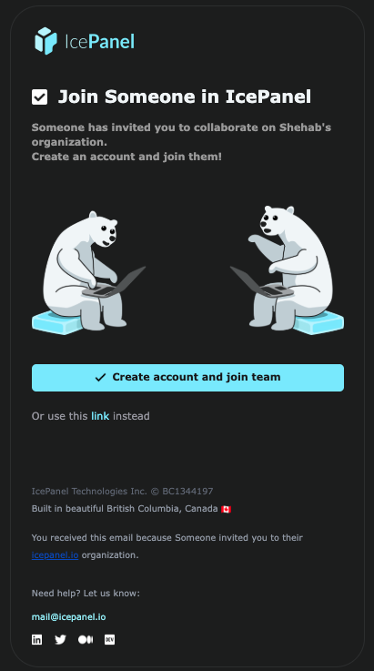

This guide shows how to invite users to your organization using the API. This is useful for automating onboarding workflows or granting temporary access to external collaborators.

<Note>
Prerequisites:
- IcePanel account
- API key (created from `https://app.icepanel.io/organizations/:organizationId/manage/api-keys`)
</Note>

```bash
export ICEPANEL_API_KEY='your-api-key'
export ICEPANEL_ORGANIZATION_ID='your-organization-id'
```

## Steps

<Steps>
  <Step title="List current invites">
    Before creating a new invite, check whether the user already has a pending one:

    <EndpointRequestSnippet endpoint="GET /organizations/{organizationId}/users/invites" />

    This endpoint returns all invites, including used and revoked ones. An invite is still active if it has no `usedAt` or `revokedAt` field and its `expiresAt` is in the future.

  </Step>

  <Step title="Create an invite">
    Send an invite to a user by email. Set `permission` to control their access level (`read`, `write`, `admin`, or `billing`), and `expiresAt` to define how long the invite remains valid.

    <EndpointRequestSnippet endpoint="POST /organizations/{organizationId}/users/invites" />

    <Warning>
    Note that invites with `write` or `admin` permission count against your paid seat limit. If you are at capacity, creating one returns a **409** error with `"All organization seats have been assigned"`.
    Invites with `read` permission do not count against this limit. [See pricing](https://icepanel.io/pricing)
    </Warning>

    Note that the `createdBy` field in the response will be `"api-key"` when created via API key, **not** a user ID. This is useful for auditing who or what triggered the invite.

    The invited user will receive an email like this:

    

    Note the invite `id` in the response if you want to revoke the invite in the next step.
  </Step>

  <Step title="Revoke an invite (optional)">
    If you need to cancel an invite before it is accepted, revoke it using the invite ID:

    <EndpointRequestSnippet endpoint="POST /organizations/{organizationId}/users/invites/{organizationUserInviteId}" />

    The response returns the updated invite object with `revokedAt` and `revokedBy` fields populated.

    <Note>
    This endpoint is idempotent. Revoking an already-revoked invite will not return an error. Revoked invites remain in the list returned by `GET /users/invites` and are not deleted.
    </Note>
  </Step>
</Steps>
